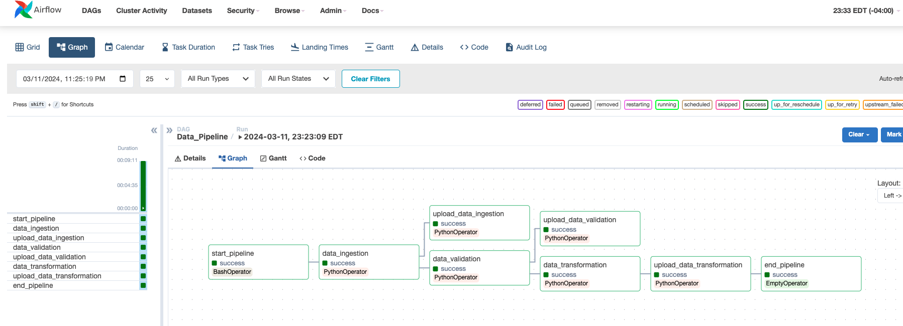

# End-to-End MLOps Pipeline for Emotion Detection

In today's digital age, understanding human emotions from various sources like audio samples has become imperative for applications ranging from customer service to mental health support. In this project, we embark on a journey to develop an end-to-end Emotion Detection MLOps pipeline leveraging the power of Google Cloud Platform (GCP).


## Table of Contents

- [End-to-End MLOps Pipeline for Emotion Detection](#end-to-end-mlops-pipeline-for-emotion-detection)
  - [Table of Contents](#table-of-contents)
  - [Folder Structure \& Coding Standards](#folder-structure--coding-standards)
      - [Read More about our Coding Standards](#read-more-about-our-coding-standards)
  - [Datasets](#datasets)
  - [Key Objectives](#key-objectives)
  - [Data Pipeline](#data-pipeline)
    - [Data Collection](#data-collection)
    - [Data Loading](#data-loading)
    - [Data Augmentation](#data-augmentation)
    - [Feature Extraction](#feature-extraction)
    - [Data Normalization](#data-normalization)
    - [Data Splitting](#data-splitting)
    - [Data Storage](#data-storage)
      - [Read more about the Data Pipeline](#read-more-about-the-data-pipeline)
  - [Instructions](#instructions)
    - [Airflow Pipeline](#airflow-pipeline)
    - [MLFlow Pipeline](#mlflow-pipeline)
    - [Core ML Module](#core-ml-module)
  - [Tools \& Technologies](#tools--technologies)
  - [Contributions](#contributions)
  - [Expected Outcomes](#expected-outcomes)
  - [Conclusion](#conclusion)
  - [License](#license)
  - [Internal Notes by the Team](#internal-notes-by-the-team)


## Folder Structure & Coding Standards

The project files are organised as follows:
[Organisation](tree.txt)

#### [Read More about our Coding Standards](docs/CodingStandards.md)

## Datasets

Our dataset comprises a diverse collection of audio samples sourced from renowned databases like the Ryerson Audio-Visual Database of Emotional Speech and Song (RAVDESS), Toronto Emotional Speech Set (TESS), Surrey Audio-Visual Expressed Emotion (SAVEE), and Crowd Sourced Emotional Multimodal Actors Dataset (CREMA-D),  augmented with audio features to enhance the model's robustness across various demographics and contexts.

Here are the Data Cards of the datasets:

1. [RAVDESS](docs/RavdessDataCard.md)
2. [TESS](docs/TessDataCard.md)
3. [SAVEE](docs/SaveeDataCard.md)
4. [CREMA-D](docs/CremaDDataCard.md)


## Key Objectives

1. **Data Preprocessing**: We will explore techniques to preprocess the audio data, including feature extraction and normalization, to prepare it for model training.

2. **Model Development**: Employing state-of-the-art deep learning architectures, we will design and train a robust Emotion Detection model capable of accurately categorizing emotional states from audio samples.

3. **Model Deployment**: Leveraging GCP's scalable infrastructure, we will deploy the trained model as a service, ensuring seamless integration with production environments and real-time inference capabilities.

4. **MLOps Integration**: Implementing best practices in MLOps, we will establish a streamlined workflow for model versioning, monitoring, and continuous integration/continuous deployment (CI/CD) to maintain model performance and reliability over time.


## Data Pipeline



### Data Collection
- The datasets are downloaded comprising of audio recordings such as speech samples labeled with corresponding emotions (e.g., happiness, sadness, anger).
- The dataset (schema) is validated the audio data is of sufficient quality and covers a diverse range of emotions and speakers.

### Data Loading
- We use audio library (librosa) to load the audio files into memory.
- Then verify that the audio data is correctly loaded and accessible for further processing.

### Data Augmentation
- We implement data augmentation techniques to increase the diversity and robustness of the training data.
- Common augmentation methods include adding noise, time-stretching, shifting, and changing pitch.
- We experiment with different augmentation strategies to simulate various real-world conditions and speech variations.

### Feature Extraction
We extract relevant features from the audio data to represent meaningful characteristics for emotion detection.

Common features include `zero-crossing rate` (**ZCR**), `root mean square energy` (**RMSE**), and `Mel-frequency cepstral coefficients` (**MFCCs**).

We use appropriate signal processing techniques and feature extraction libraries (e.g., librosa) to compute the features.

### Data Normalization
- We normalize the extracted features to ensure that they have consistent scales and distributions.
- Our normalization techniques include z-score normalization and min-max scaling.

### Data Splitting
- We finally split the preprocessed data into training, validation, and test sets.
- We also ensure that each set contains a representative distribution of emotions to prevent bias.

### Data Storage
- We save the preprocessed data and  corresponding labels in a suitable format (e.g., CSV, parquet) along with compression (e.g, gzip) for easy access during model training.
- We organize the data into directories or files based on the chosen storage format and directory structure.
- Finally, the last stage of our data pipeline uploads the data into Google Cloud Storage (GCS) for later retrieval and uses.

#### [Read more about the Data Pipeline](docs/DataPipeline.md)

## Instructions

Below contains guidance on how to execute the modules.

The application has been containerized to reduce the manual execution of comands required for the application to work.
The entire application is orchestrated by Airflow so running the Docker container for Airflow essentially empowers the execution of the entire application. Here is how to run the Docker container:

### Airflow Pipeline

- Move to the **pipeline/airflow** directory
- With the **airflow** directory as your working directory, run the following command to start airflow in docker one after the other:

```bash
docker compose up airflow-init
```
This command initializes the database and services needed to start and run the airflow webserver, scheduler, etc.

```bash
docker compose up
```
This service starts the airflow services in various containers.
To open the Airflow UI, open the following link in your browser:
[http://0.0.0.0:8080/home](http://0.0.0.0:8080/home)


### MLFlow Pipeline

- Move to the **$HOME** directory
- Create your virtual environment and install all the dependencies

```python
pip install -r ./src/mlflow/requirements.txt
```

- Start MLFlow Web UI:

```bash
mlflow ui --port=5001
```
This will fire up the MLFlow UI, and open the following link in your browser:
[http://0.0.0.0:5001](http://0.0.0.0:5001)

- In order to log experiments using MLFlow execute the Trainer module from the **$HOME** directory:

```python
python ./src/mlflow/mlflow_trainer.py
```

### Core ML Module

The modules can also be executed in the local environment. In order to do so, build the module from the `src` directory using `setup.py`. Here is how to build the module:

  > [!WARNING]
  > All codes/commands have to be executed from the **pipeline->airflow->dags** folder.
   - Move to the **dags** in project directory

  > [!IMPORTANT]
  > In order to execute this module you will need to *build* and *install* the module as a package, otherwise you will get the error
  ```bash
  ModuleNotFoundError: No module named 'mlcore'
  ```

   - Start with installing the dependencies first.

   ```python
   pip install -r requirements.txt
   ```

   - Build the module binaries

   ```python
   python setup.py sdist
   ```

   - Install the build

   ```python
   python setup.py install
   ```

  > [!IMPORTANT]
  Every time you make some changes in the configurations, you will have to **build the module** manually, so that your changes are reflected. We will later automate this using GitHub Workflows / other CICD options.
That means you need to run the previous command from the root folder.


- In order to run any of the data scripts, use commands:
```python
python stage_03_data_transformation.py  
```

## Tools & Technologies


 


 


**Google Cloud Platform (GCP)**: Compute Engine, Cloud Storage, BigQuery and Vertex AI Platform for scalable infrastructure, data storage, model training, and deployment. The entire project is planned to implemented in **GCP only** with Google Kubernetes Engine (GKE), however, the project is cloud agnostic, so it can be easily integrated into Microsoft Azure, AWS or others providers and platforms like MinIO.

**Airflow**: Orchestration of data preprocessing and transformation, notification pipelines.

**TensorFlow-Keras / PyTorch**: Utilized for developing and training deep learning models for Emotion Detection.

**MLflow**: Integrated for managing machine learning workflows and experimentation.

**DVC**: Integration of DVC for version controlling the data, and tracking the data provenance.

**Optuna**: Integration of Optuna for hyperparameter tuning and tracking via MLflow.

**Apache Beam**: [Planned] Will transfer our data preprocessing and transformation pipelines to Apache Beam for scalability.

OR

**KubeFlow**: [Planned] The entire pipeline will be transferred to KubeFlow for orchestration


**KServe**: [Planned] We plan to serve the inferencing pipeline using KServe (Kubernetes on GKE)


## Contributions

Create a fork of the repository and submit a pull request after adding your changes subjected to approval by the team.


## Expected Outcomes

- A production-ready Emotion Detection model capable of accurately categorizing emotional states from audio samples.

- A scalable MLOps pipeline on GCP for model training, deployment, and monitoring, ensuring robustness and reliability in real-world applications.


## Conclusion

Through this project, we aim to demonstrate the efficacy of leveraging GCP's infrastructure and MLOps practices to develop and deploy sophisticated Emotion Detection solutions, with potential applications spanning diverse domains such as mental health support, customer sentiment analysis, and human-computer interaction.

## License

This project is licensed under the [MIT License](LICENSE).


## Internal Notes by the Team

**1. How to contribute to the the pipeline (How to develop your own dags)**

The dags, logs, plugins and secrets folders are copied into the container and are updated in real-time. Any changes you make to the files inside these folders will reflect inside the container.


