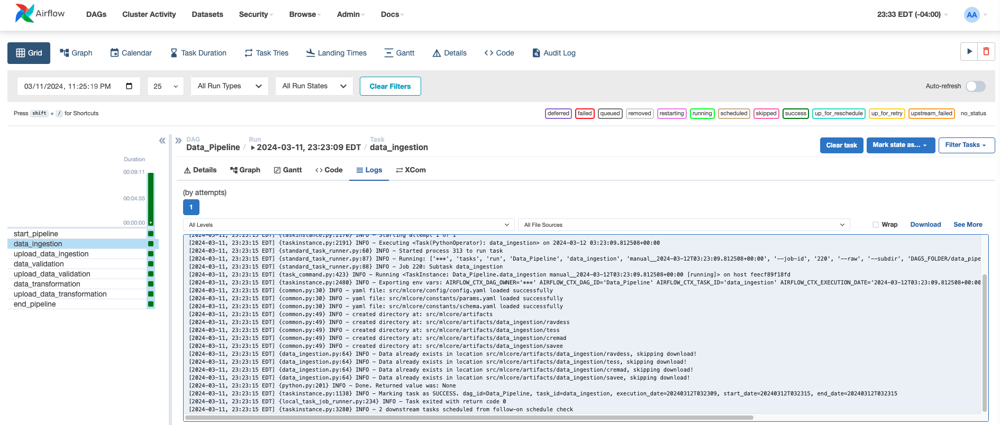
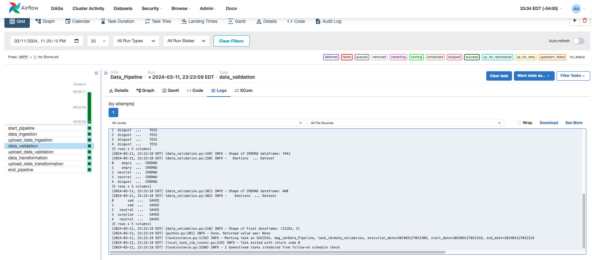
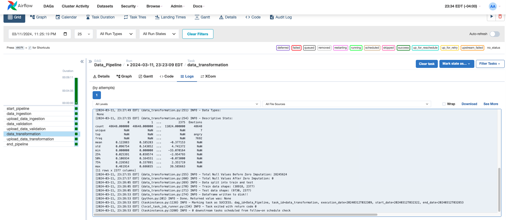
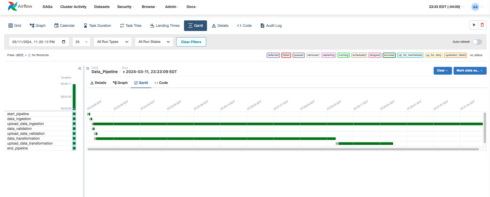
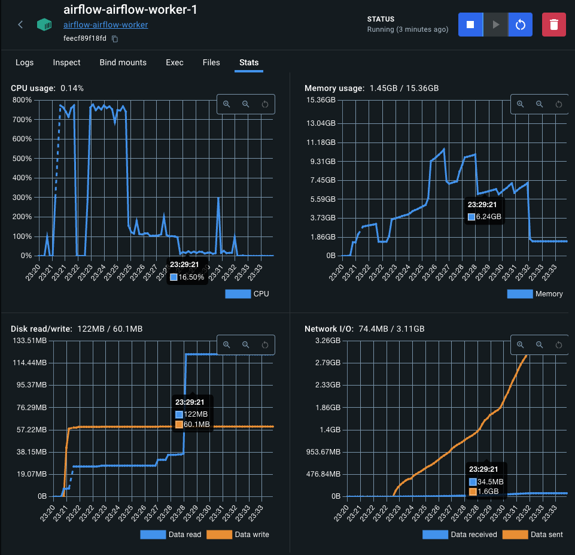

## Data Pipeline

### Introduction

This README provides a comprehensive guide to the data preprocessing steps for speech emotion recognition (SER) from audio signals. The process involves collecting, loading, augmenting, extracting features, normalizing, splitting, and storing the data. Additionally, it covers the integration of data preprocessing tasks with Apache Airflow for orchestration and pipeline optimization.

### Data Collection
This stage of our pipeline is marked as ***Data Ingestion***
- The datasets comprising of four most popular SER datasets (RAVDESS, TESS, SAVEE & CREMA-D) are downloaded comprising of audio recordings such as speech samples labeled with corresponding emotions (e.g., happiness, sadness, anger).
- The dataset used for this project are selectively choosen from the large database of audio data and is diverse, covering various speakers and their emotional expressions.
- The quality and authenticity of the collected data is verified to be reliable for model training.

### Data Loading
This stage of our pipeline is marked as ***Data Validation***
- We use audio library (librosa) to load the audio files into memory.
- We also generate a metadata file containing the path to the actual audio files and labels along with some additional details about the audio, speaker and intensity.
- Then this metadata file's schema is validated with pre-defined schema information, to ensure that data in wrong formats does not cause issues. We use frozen sets of dataclasses to ensure this rigid schema.
- We check for data integrity issues such as corrupted files or missing samples.
- We implement error handling mechanisms to handle any loading failures gracefully.
- Once all our checks are done, we create a status file with the the output from the validation process.

### Data Transformation

This is the core data transformation which involves multiple transformation applied to each audio sample.

### Data Augmentation
- We implement data augmentation techniques to increase the diversity and robustness of the training data.
- Our default augmentation methods include adding Additive White Gaussian Noise (AGWN), time-stretching, shifting, changing pitch and combinations of there parameters.
- We experiment with different augmentation strategies to simulate various real-world conditions and speech variations.
- We experiment with different augmentation strategies during training and evaluate the results.

### Feature Extraction
We extract relevant features from the audio data to represent meaningful characteristics for emotion detection.

Our extracted features include `zero-crossing rate` (**ZCR**), `root mean square energy` (**RMSE**), and `Mel-frequency cepstral coefficients` (**MFCCs**).

- **Zero-crossing rate (ZCR)**: Measures the rate at which the audio signal changes its sign, often used to characterize the frequency content of the signal.

- **Root mean square energy (RMSE)**: Represents the overall energy of the audio signal, providing insights into its loudness or amplitude variations.

- **Mel-frequency cepstral coefficients (MFCCs)**: Captures the spectral characteristics of the audio signal by extracting features from its frequency-domain representation.

We use appropriate signal processing techniques and feature extraction libraries (e.g., librosa) to compute the features. The output from this stage creates features which are numerical and computed from the raw audio signals.

### Data Normalization
- The extracted features array, however, are not consistent in the size as it completely depends on the raw signal and the duration of the signal.
- Since the raw signal tails off for shorter duration of the signal, we impute zero values to the missing values to make the signal size consistent with the rest of the data.
- We normalize the extracted features to ensure that they have consistent scales and distributions.
- Our normalization techniques include z-score normalization and min-max scaling.

### Data Splitting
- We finally split the preprocessed data into training and test sets (80-20 split).
- We also ensure that each set contains a representative distribution of emotions to prevent bias.

### Data Storage
- We save the preprocessed data and  corresponding labels in a suitable format (e.g., CSV, parquet) along with compression (e.g, gzip) for easy access during model training.
- We organize the data into directories or files based on the chosen storage format and directory structure.
- Finally, the last stage of our data pipeline uploads the data into Google Cloud Storage (GCS) for later retrieval and uses.

### Integration with Apache Airflow
- Apache Airflow is an open-source platform for orchestrating complex data workflows. We containerize the data using Docker for better handling of dependencies across the team.
- We integrate data preprocessing tasks with Airflow to automate the execution and monitoring of the preprocessing pipeline.
- Defining Airflow DAGs (Directed Acyclic Graphs) to represent the workflow, including tasks for each preprocessing stage (e.g., loading, validation, transformation).
- We use Airflow operators to execute individual tasks within the DAG, with dependencies to ensure proper sequencing and parallelism.

- We utilize Airflow's scheduling, retry, and monitoring capabilities to optimize pipeline execution and handle failures gracefully.
- We leverage Airflow's integration with cloud services (GCP) for scalable and distributed processing of large datasets.
- We monitor pipeline performance and resource utilization using Airflow's built-in dashboards and logging features.

